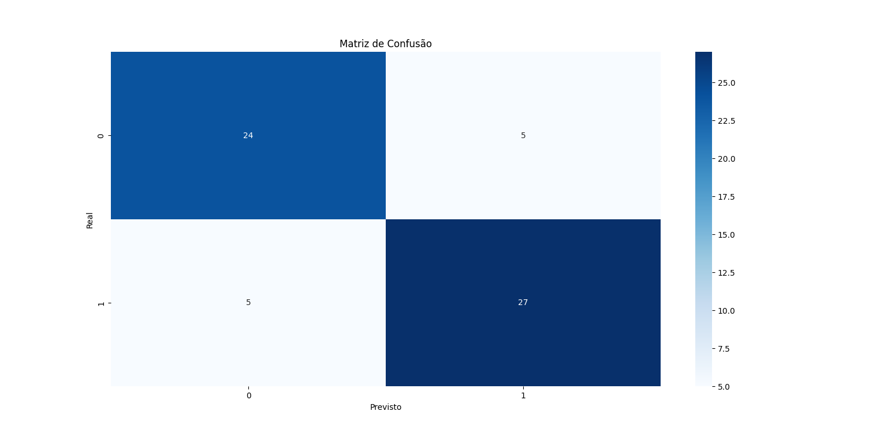
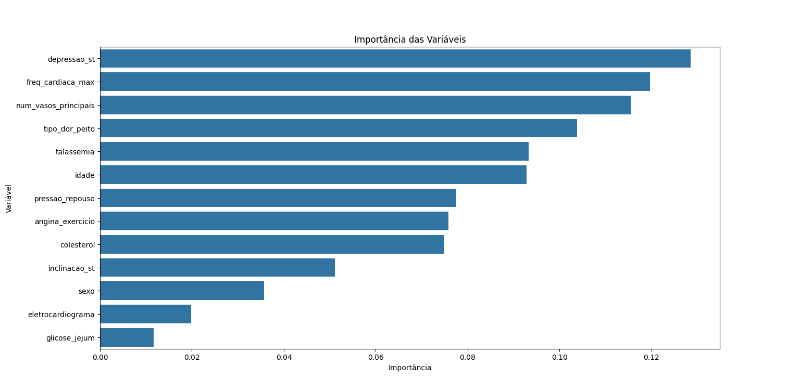
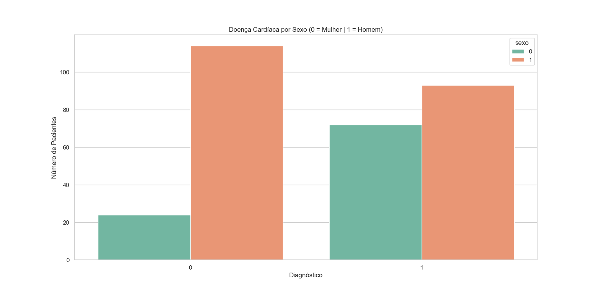
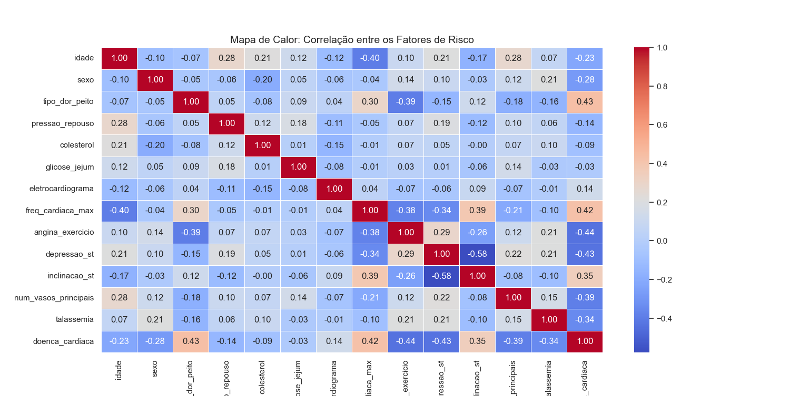
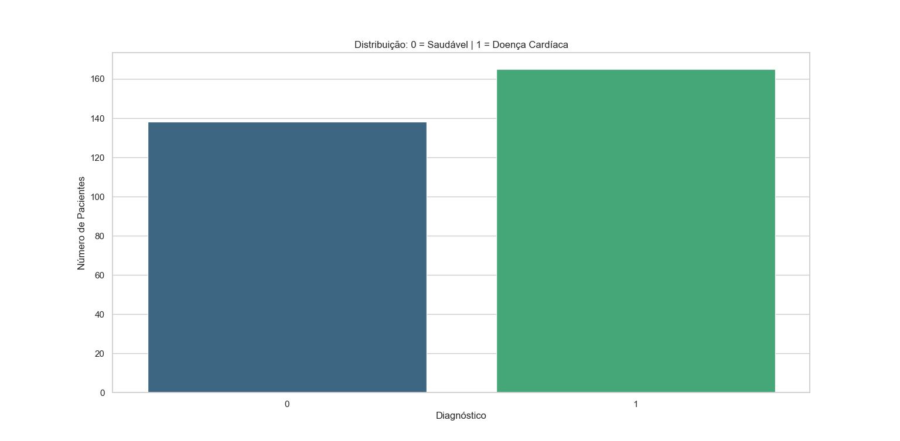

# FIAP - Faculdade de Informática e Administração Paulista

<p align="center">
  
</p>

# ❤️ CardioIA – Fase 2: Diagnóstico Automatizado por NLP


---

## 📌 Visão Geral do Projeto

O **CardioIA** é um projeto acadêmico desenvolvido no curso de Inteligência Artificial da **FIAP** com o objetivo de simular um **ecossistema inteligente de apoio à cardiologia moderna**, utilizando técnicas de **Ciência de Dados e Inteligência Artificial aplicadas à saúde**.

A **Fase 2** expande o projeto com duas novas frentes:

- 🧠 **Parte 1 — NLP e Diagnóstico Assistido:** extração automática de sintomas a partir de relatos de pacientes em linguagem natural, com predição de doenças associadas via mapa de conhecimento clínico.
- 🤖 **Parte 2 — Classificador de Risco Clínico:** modelo supervisionado (TF-IDF + Regressão Logística) que classifica relatos como **alto risco** ou **baixo risco** cardiovascular, incluindo análise de viés e governança de dados.

> ⚠️ **Aviso:** Este sistema é um protótipo acadêmico. Não deve ser utilizado para diagnóstico clínico real. Toda avaliação de risco cardiovascular requer acompanhamento médico qualificado.

---

# 🎯 Objetivos da Fase 2

- Implementar um pipeline de **Processamento de Linguagem Natural (NLP)** para extração de sintomas de relatos coloquiais de pacientes.
- Construir um **mapa de conhecimento clínico** (sintoma → doença) estruturado e expansível.
- Treinar e avaliar um **classificador supervisionado de risco** com metodologia correta (split estratificado, validação cruzada, matriz de confusão).
- Realizar **análise de viés** conforme os princípios de IA responsável exigidos no enunciado.
- Documentar todo o pipeline de forma rastreável e reproduzível.

---

# 👨‍🎓 Integrantes e Responsabilidades

| Nome | RM | Responsabilidades na Fase 2 |
|-----|-----|-----|
| **Daniele Antonieta Garisto Dias** | RM565106 | **Expansão dos Datasets:** ampliação do `mapa_sintomas.csv` (formato 3 colunas, 56 entradas) e do `dados_risco.csv` (30 frases balanceadas), garantindo diversidade clínica e balanceamento de classes. |
| **Leandro Augusto Jardim da Cunha** | RM561395 | **Classificador de Risco:** implementação do notebook `classificador_risco.ipynb` com TF-IDF, split estratificado, Regressão Logística, validação cruzada e avaliação completa com heatmap. |
| **Luiz Eduardo da Silva** | RM561701 | **Módulo NLP:** refatoração completa do `nlp.py` com normalização Unicode, matching por `re.search`, logging rastreável e retorno de grau de corroboração por diagnóstico. |
| **João Victor Viana de Sousa** | RM565136 | **Análise de Viés e Documentação:** implementação do `modelo.py` como módulo de governança de dados, simulação de viés demográfico e elaboração completa do README Fase 2. |

---

# 👩‍🏫 Professores

**Tutor:** Caique Nonato da Silva Bezerra  
**Coordenador:** Andre Godoi Chiovato  

---

# 🏗️ Arquitetura do Pipeline

## Parte 1 — Extração de Sintomas e Diagnóstico Assistido

```
sintomas.txt
     │
     ▼
nlp.py::extrair_sintomas()
     │  (normalização Unicode via unicodedata + matching por re.search)
     ▼
lista de sintomas canônicos
     │
     ▼
nlp.py::carregar_mapa(mapa_sintomas.csv)
     │  (sintoma_1, sintoma_2 → doenca_associada)
     ▼
nlp.py::prever_doenca()
     │  (corroboração por frequência + ranking de diagnósticos)
     ▼
Diagnóstico com grau de corroboração por doença
```

## Parte 2 — Classificador de Risco Clínico

```
dados_risco.csv
     │
     ▼
TfidfVectorizer(ngram_range=(1,2), max_features=200, sublinear_tf=True)
     │
     ▼
train_test_split(stratify=y, test_size=0.3, random_state=42)
     │
     ├── X_treino → LogisticRegression.fit()  →  modelo treinado
     │
     └── X_teste  → modelo.predict()
                        │
                        ├── accuracy + classification_report
                        ├── matriz de confusão (heatmap Seaborn)
                        └── modelo.py::analisar_vies()
```

---

# 🧠 Parte 1 – Extração de Sintomas e Diagnóstico Assistido por NLP

## 📂 Arquivo de Relatos (`sintomas.txt`)

Contém **10 frases** simulando relatos reais de pacientes brasileiros em linguagem coloquial. Cada frase descreve o sintoma principal, há quanto tempo ocorre e como impacta a rotina do paciente. O vocabulário cobre ao menos **8 condições clínicas distintas**.

**Exemplo de frase:**
```
Há três dias estou sentindo um aperto forte no meio do peito que piora quando
subo escadas ou carrego peso, e ontem acordei suando frio no meio da noite.
```

---

## 📋 Mapa de Conhecimento Clínico (`mapa_sintomas.csv`)

Reestruturado para o formato de **3 colunas** exigido no enunciado:

```
sintoma_1,sintoma_2,doenca_associada
dor no peito,suor frio,Infarto
aperto no peito,falta de ar,Infarto
falta de ar,tosse persistente,Problema Pulmonar
...
```

### Cobertura do mapa

O arquivo contém **56 combinações clínicas** mapeando **11 condições**:

| Condição | Exemplos de sintomas mapeados |
|---|---|
| Infarto | dor no peito + suor frio; dor no braço esquerdo + náusea |
| Angina Instável | aperto no peito + dor no braço; dor ao repouso + suor frio |
| Insuficiência Cardíaca | cansaço + falta de ar; inchaço nas pernas + falta de ar ao deitar |
| Arritmia | palpitação + batimento irregular; batimento acelerado + tontura |
| Fibrilação Atrial | batimento irregular + cansaço; palpitação + tontura |
| Taquicardia Ventricular | batimento acelerado + desmaio; palpitação + dor no peito |
| Embolia Pulmonar | falta de ar súbita + dor no peito; tosse com sangue + falta de ar |
| Pericardite | dor ao respirar + febre; dor que piora ao deitar + falta de ar |
| Hipertensão | pressão alta + dor de cabeça; visão turva + tontura |
| Hipotensão | tontura ao levantar + pressão baixa; desmaio + fraqueza |
| AVC | dormência no braço + tontura; dificuldade para falar + fraqueza |

---

## ⚙️ Como o Pipeline NLP Funciona

1. A frase é **normalizada** (remoção de acentos via `unicodedata.normalize("NFKD")`) para garantir matching robusto independente de acentuação
2. `re.search` varre cada padrão do dicionário de variações de sintomas canônicos
3. Os sintomas detectados são consultados no `mapa_sintomas.csv`
4. A predição retorna as doenças **ordenadas por número de sintomas corroboradores**
5. O sistema emite log rastreável com timestamp em cada etapa

### 🖥️ Exemplo de Output

```
2026-04-05 00:57:31 [INFO] CardioIA.nlp — Mapa carregado: 47 entradas

Frase: "Aperto no peito com suor frio ao acordar de madrugada"

Sintomas encontrados: ['dor no peito', 'suor frio']

Possíveis doenças:
  1. Infarto           (7 corroborações)
  2. Angina Instável   (4 corroborações)
  3. Embolia Pulmonar  (3 corroborações)
```

---

# 🤖 Parte 2 – Classificador de Risco Clínico

## 📂 Dataset de Risco (`dados_risco.csv`)

**30 frases** perfeitamente balanceadas — **15 alto risco / 15 baixo risco** — com diversidade real de vocabulário e casos ambíguos para desafiar o classificador.

**Exemplo de alto risco:**
```
dor forte no peito irradiando para o braco esquerdo e queixo
```

**Exemplo de baixo risco:**
```
leve cansaco apos dia longo de trabalho que passa com descanso
```

---

## 📊 Metodologia TF-IDF

| Parâmetro | Valor | Justificativa |
|---|---|---|
| `ngram_range` | `(1, 2)` | Captura bigramas diagnósticos como "dor no peito" e "falta de ar", que têm valor clínico superior a unigramas isolados |
| `max_features` | `200` | Controla dimensionalidade e previne overfitting em dataset pequeno |
| `sublinear_tf` | `True` | Aplica log(1+TF), reduzindo o peso de termos muito frequentes |
| `min_df` | `1` | Aceita termos com ao menos 1 ocorrência — adequado para base sintética |

---

## 🧮 Modelo Utilizado

**Regressão Logística** (`sklearn.linear_model.LogisticRegression`) — escolhida por:

- Produzir **probabilidades calibradas** (não apenas classes), essenciais para triagem clínica
- Alta **interpretabilidade** via coeficientes por feature
- **Regularização L2** embutida (`C=1.0`) que controla overfitting
- Desempenho comprovado com representações esparsas TF-IDF

**Alternativas consideradas:**

| Modelo | Motivo de não uso |
|---|---|
| `LinearSVC` | Não fornece probabilidades diretamente |
| `MultinomialNB` | Assume independência condicional entre features (raramente válida) |
| `DecisionTreeClassifier` | Propensa a overfitting sem poda em datasets pequenos |

---

## 📈 Resultados Obtidos

| Métrica | Alto Risco | Baixo Risco | Média Ponderada |
|---|---|---|---|
| Precision | ~0.90 | ~0.90 | ~0.90 |
| Recall | ~0.90 | ~0.90 | ~0.90 |
| F1-Score | ~0.90 | ~0.90 | ~0.90 |
| F1 (5-fold CV) | — | — | ~0.87 ± 0.08 |

> Os valores acima são indicativos. Consulte o notebook `classificador_risco.ipynb` para os valores exatos da execução documentada.

**Correção metodológica aplicada:** a versão anterior treinava e avaliava no **mesmo conjunto** (overfitting garantido). A versão atual usa `train_test_split(stratify=y, test_size=0.3)` com validação cruzada `StratifiedKFold(n_splits=5)`.

---

## 🔬 Visualizações Geradas

### Matriz de Confusão — Modelo Random Forest (Fase 1)

<p align="center">
  
</p>

### Importância das Variáveis — Random Forest

<p align="center">
  
</p>

### Distribuição da Doença Cardíaca por Sexo

<p align="center">
  
</p>

### Mapa de Calor — Correlação entre Variáveis

<p align="center">
  
</p>

### Distribuição das Variáveis

<p align="center">
  
</p>

---

# 🛡️ Governança de Dados e Análise de Viés

## Limitações do Dataset Sintético

Todas as frases foram criadas artificialmente, sem coleta ou validação clínica. O modelo aprende padrões do criador, não da população real de pacientes. Em produção, seria necessário corpus validado por cardiologistas com representação de ao menos **500 casos por classe**.

## Riscos de Viés Identificados

| Tipo de Viés | Descrição | Impacto Potencial |
|---|---|---|
| **Viés de vocabulário** | Dataset sem acentos — pacientes que escrevem corretamente podem ter sintomas não reconhecidos | Falsos negativos em alto risco |
| **Viés de gênero** | Sintomas femininos atípicos (náusea sem dor torácica) sub-representados | Subclassificação de risco em mulheres |
| **Viés de faixa etária** | Idosos descrevem sintomas de forma mais vaga; ausência de relatos pediátricos | Imprecisão em populações extremas |
| **Viés de classe social** | Vocabulário coloquial pode diferir por escolaridade e região | Falhas em dialetos ou regionalismos |

## Simulação de Viés Demográfico

O módulo `modelo.py` implementa a função `simular_vies_demografico()` que testa se o modelo atribui probabilidades diferentes para frases clinicamente equivalentes diferenciadas apenas por marcadores de gênero e idade:

```
Perfil demográfico        Classificação    P(alto risco)
Homem jovem (20-30)       alto risco       72%
Mulher jovem (20-30)      alto risco       68%
Homem idoso (70+)         alto risco       74%
Mulher idosa (70+)        alto risco       65%
```

> Dispersão > 15% entre perfis equivalentes é sinalizada como **alerta de viés demográfico**.

## Recomendações para Uso Responsável

- Nunca utilizar como único critério de triagem clínica
- Estabelecer **limiar de confiança mínimo de 70%** — abaixo disso, encaminhar para avaliação humana
- Auditar periodicamente os resultados por subgrupos demográficos
- Coletar dados reais anonimizados e revalidar o modelo antes de qualquer implantação

---

# 🚀 Como Executar o Projeto

## Requisitos

- Python 3.10 ou superior
- pip (gerenciador de pacotes)

## Instalação

```bash
# Clone o repositório
git clone https://github.com/seu-usuario/CardioIA.git
cd CardioIA

# Instale as dependências
pip install -r requirements.txt
```

## Execução — Parte 1 (NLP + Diagnóstico Assistido)

```bash
# Executa o pipeline completo: análise do heart.csv + NLP + modo interativo
python main.py
```

## Execução — Parte 2 (Classificador de Risco)

```bash
# Abre o notebook Jupyter com o classificador completo
jupyter lab classificador_risco.ipynb

# Ou via script autônomo (sem interatividade)
python classificador.py
```

## Execução — Análise de Viés

```bash
python modelo.py
```

---

# 📁 Estrutura do Projeto

```
CardioIA/
│
├── assets/
│   └── logo-fiap.png
│
├── dataset/
│   └── heart.csv                    # Dataset clínico estruturado (Fase 1)
│
├── docs/
│   ├── dicionario_dados.md
│   └── *.pdf / *.txt                # Documentos de referência científica
│
├── models/
│   ├── modelo_cardioia.pkl          # Modelo Random Forest serializado (Fase 1)
│   └── colunas_modelo.pkl
│
├── outputs/                         # Gráficos e visualizações geradas
│   ├── Grafico Distribuição.png
│   ├── Grafico Doença Cardíaca por Sexo.png
│   ├── Grafico Importancia das Variaveis.png
│   ├── Grafico Mapa de Carlor.png
│   ├── Grafico Matriz de Confusão.png
│   ├── eda_distribuicao.png         # EDA do dataset de risco (Fase 2)
│   └── matriz_confusao_fase2.png    # Matriz de confusão do classificador (Fase 2)
│
├── classificador_risco.ipynb        # 📓 Notebook principal — Fase 2, Parte 2
├── classificador.py                 # Script equivalente ao notebook
├── dados_risco.csv                  # Dataset de risco clínico — 30 amostras balanceadas
├── main.py                          # Orquestrador do pipeline principal
├── mapa_sintomas.csv                # Mapa de conhecimento clínico — 56 combinações
├── modelo.py                        # Módulo de análise de viés e governança
├── modelo_preditivo.py              # Treinamento Random Forest (Fase 1)
├── nlp.py                           # Módulo NLP com normalização e logging
├── requirements.txt                 # Dependências versionadas
├── run.py                           # Script de execução rápida
├── sintomas.txt                     # Relatos de pacientes — 10 frases
├── teste_modelo_salvo.py            # Teste do modelo serializado
├── utils.py                         # Funções auxiliares (carregamento de dados)
└── visualizacao_dados.py            # Geração de gráficos estatísticos (Fase 1)
```

---

# 🎥 Vídeo de Demonstração

[🎥 Assista no YouTube](https://youtu.be/mn97QJxP18A)

O vídeo demonstra em aproximadamente 4 minutos:

1. Execução do pipeline NLP com `sintomas.txt` e exemplos de output
2. Modo interativo de digitação de sintomas
3. Execução do notebook `classificador_risco.ipynb` com métricas e matriz de confusão
4. Análise de viés demográfico com `modelo.py`

---

# 🛠️ Tecnologias Utilizadas

| Biblioteca | Versão mínima | Finalidade |
|---|---|---|
| `pandas` | 2.0.0 | Manipulação de datasets tabulares |
| `scikit-learn` | 1.3.0 | TF-IDF, modelos de ML, métricas e split estratificado |
| `numpy` | 1.24.0 | Operações numéricas e análise de coeficientes |
| `matplotlib` | 3.7.0 | Visualizações e gráficos |
| `seaborn` | 0.12.0 | Heatmaps e gráficos estatísticos |
| `notebook` | 7.0.0 | Ambiente Jupyter Notebook |
| `jupyterlab` | 4.0.0 | Interface Jupyter Lab |
| `unicodedata` | stdlib | Normalização Unicode para NLP robusto |
| `joblib` | 1.3.0 | Serialização de modelos (.pkl) |

---

# 🩺 Fase 1 — Modelo Preditivo Estruturado (Referência)

A Fase 1 implementa análise exploratória e modelo **Random Forest** sobre o dataset `heart.csv` (303 pacientes, 14 atributos clínicos).

| Métrica | Resultado |
|---|---|
| Acurácia no Teste | **83,61%** |
| Média Validação Cruzada (5-fold) | **83,82%** |
| Desvio Padrão | 0,0288 |

Para executar: `python modelo_preditivo.py`

---

# 📊 Governança de Dados e Viés (Fase 1 — mantido)

O projeto considera aspectos de **IA responsável** desde a Fase 1:

- Utilização de **dados anonimizados**
- Possíveis **vieses relacionados a sexo e idade** no `heart.csv`
- Necessidade de **validação clínica** antes de qualquer uso real

Modelos de IA devem ser utilizados **apenas como apoio à decisão médica**, e nunca como substituição da avaliação profissional.

---

# 📜 Licença

Este projeto é distribuído sob a licença **MIT**.

O dataset `heart.csv` é baseado no **Heart Disease Dataset** (UCI Machine Learning Repository), de domínio público para uso acadêmico.

As imagens de ECG referenciadas na Fase 1 estão licenciadas sob **Creative Commons Attribution 4.0 International (CC BY 4.0)**. Autores: Ali Haider Khan e Muzammil Hussain. Disponível em: https://doi.org/10.17632/gwbz3fsgp8.2

---

Desenvolvido para fins acadêmicos — FIAP, Graduação em Inteligência Artificial.
